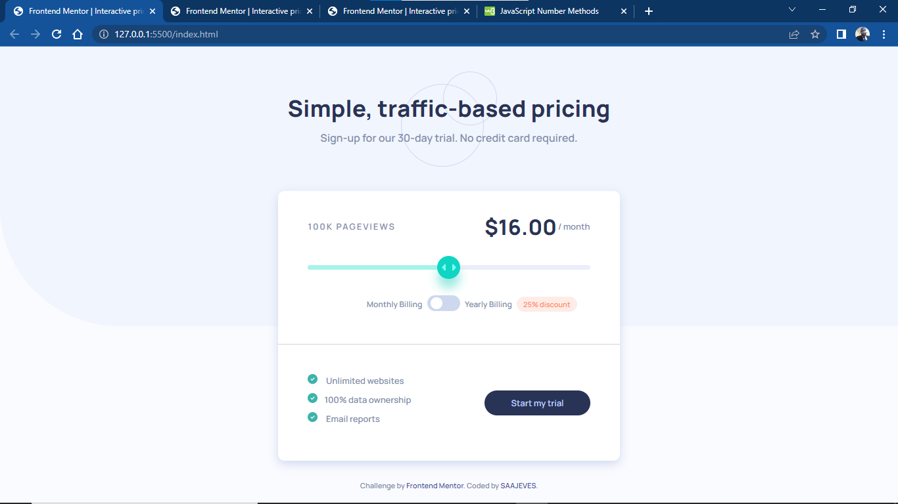

# Frontend Mentor - Interactive pricing component solution

This is a solution to the [Interactive pricing component challenge on Frontend Mentor](https://www.frontendmentor.io/challenges/interactive-pricing-component-t0m8PIyY8). Frontend Mentor challenges help you improve your coding skills by building realistic projects.

## Table of contents

- [Overview](#overview)
  - [The challenge](#the-challenge)
  - [Screenshot](#screenshot)
  - [Links](#links)
- [My process](#my-process)
  - [Built with](#built-with)
  - [What I learned](#what-i-learned)
  - [Continued development](#continued-development)
  - [Useful resources](#useful-resources)
- [Author](#author)
- [Acknowledgments](#acknowledgments)

## Overview

### The challenge

Users should be able to:

- View the optimal layout for the app depending on their device's screen size
- See hover states for all interactive elements on the page
- Use the slider and toggle to see prices for different page view numbers

### Screenshot

### Links

- Solution URL: [www.saajevessolutionforthisproject.com](https://github.com/SAAJEVES/FrontendMentor-challenge-on-JS-J06)
- Live Site URL: [www.saajeveslivesiteforthisproject.com](https://saajeves.github.io/FrontendMentor-challenge-on-JS-J06/)

## My process

### Built with

- Semantic HTML5 markup
- CSS custom properties
- Grid

### What I learned

I learnt how to customize range and also toggle. Concerning the customise toggle, I came to see the importance of the `label` tag element. And this is my first time of using the `switch` statement and `grid` display in a project.

### Continued development

Continued development in `HTML, CSS and JavaScript`.

### Useful resources

A lot of resources was helpful not just in this project but from the beginning of my learning of web development.

- [w3schools](https://www.w3schools.com)

- [freecodecamp](https://www.freecodecamp.com)

- [youtube](https://www.youtube.com)

- And lots more. Surely, I will always recommend them days in and days out

## Author

- Github - [go to my github account](https://github.com/SAAJEVES)
- Frontend Mentor - [go to my frontend mentor account](https://www.frontendmentor.io/profile/SAAJEVES)
- Twitter - [go to my twitter account](https://www.twitter.com/saajeves)
- LinkedIn - [go to my linkedin account](https://www.linkedin.com/in/samuel-ajagun-020283150)

## Acknowledgments

I would love to acknowledge [a very good friend of mine and mentor](https://github.com/wisdomosara) for his immense contribution on helping me in this project. You are well appreciated.
